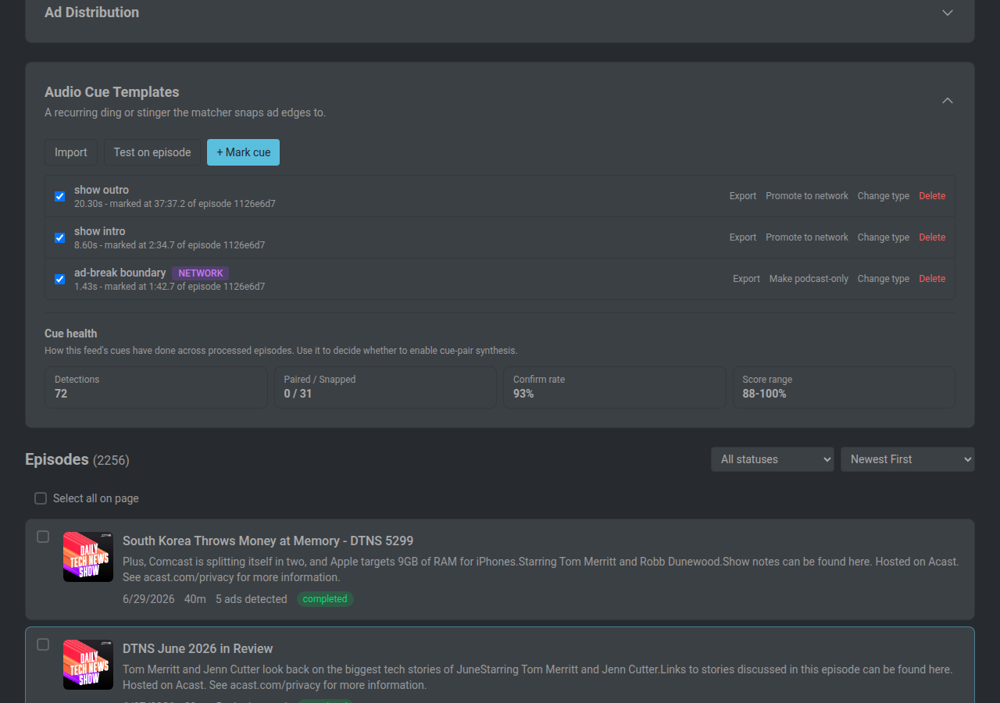
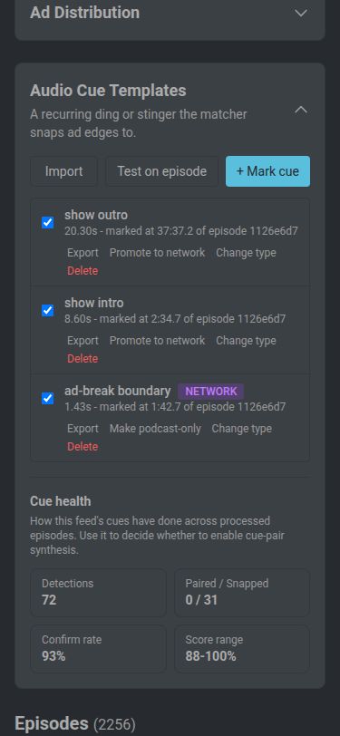
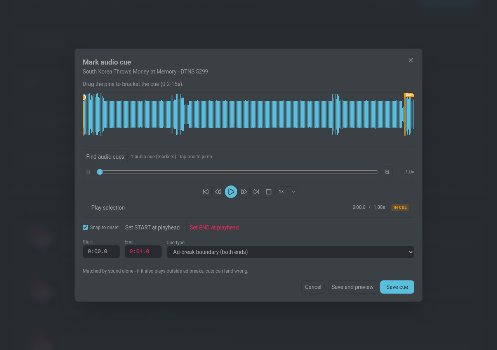
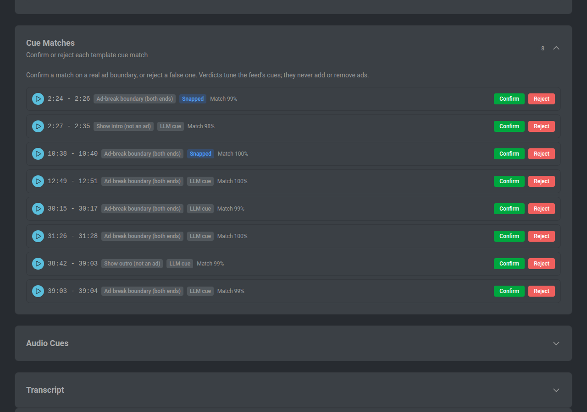
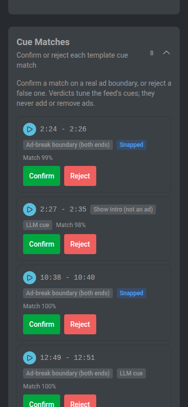

# Audio Cue Detection

[< Docs index](README.md) | [Project README](../README.md)

---

Some shows play a short non-spoken cue, a chime or stinger, right before or after
an ad break. The transcript cannot capture it, so detection lands a beat late. A
cue never marks an ad on its own: the model must still find ad content in the
transcript, and the cue only sharpens an ad's boundaries. The one exception is
the opt-in cue-pair setting below, which can propose a missed break for the
reviewer to evaluate.

Audio cue detection is off by default. Turn it on under Settings > Experiments >
Audio Cue Detection. It applies only to episodes processed after you enable it.

## How it finds the cue

There are two ways to find a cue, both gated by the master toggle.

- **Per-feed templates (recommended).** You mark the exact sound once on a recent
  episode. The server stores an MFCC fingerprint and a normalized
  cross-correlation matcher finds that same sound on every other episode of the
  feed. A template can move an ad's edges. When a feed has at least one enabled
  template, the matcher is used for that feed instead of the spectral fallback.
- **Spectral fallback.** When a feed has no templates and the experiment is on,
  an extra ffmpeg pass band-passes the audio to the cue's frequency band and
  flags brief loudness bursts that stand out from the in-band speech baseline.
  Each burst is handed to the detector as an `audio_cue` signal, the same way
  volume changes and DAI transitions already are. The spectral path is evidence
  only; it never moves an edge.

After detection, a boundary-snap pass moves the start and end of a detected ad to
the nearest high-confidence cue, capped by the reviewer's Max boundary shift, so
the cut lands on the chime rather than a beat into or out of the spoken read.

## Cue types

You pick a type from a fixed dropdown rather than typing a label, so the model
always sees a consistent phrase. The type also decides which edge the cue may
move:

- **Ad-break boundary (both ends)** - the same sound plays entering and leaving
  the break. Snaps either edge of a detected ad. This is the default.
- **Ad-break start** - snaps an ad's start only, and opens a span when cue-pair
  gap-filling is on.
- **Ad-break end** - snaps an ad's end only, and closes a span.
- **Show intro / Show outro** - the show's own open or close sound, not an ad.
  The model is told to ignore it as a boundary so it stops mis-reading an intro
  sting as a break. Never moves a boundary.
- **Content transition (may or may not be an ad)** - a recurring segment-break
  sound that may or may not sit next to an ad. Never cut on its own; the model is
  told a transition happens there, not an ad boundary.

## Marking a cue

Open the feed and expand Audio Cue Templates, then click `+ Mark cue` and pick a
recent episode whose original audio is still retained. The picker only lists
episodes that still have their original, since a cue can sit inside a removed ad.

The mark dialog uses the same waveform as the ad editor. Drag the green and red
pins to bracket the cue (0.2 to 10 seconds by default, up to 60 for a show intro or outro), or play to the sound and use
Set START / Set END at the playhead. The Snap to onset assist nudges an edge to
the nearest sharp amplitude rise so a short ding is easy to bracket tightly; turn
it off for a ramped sound with no clean attack. Pick a cue type, then Save, or
Save and preview to see every place the cue matches on that episode before it
goes live.

## Finding cues automatically

Instead of hunting for the sound by ear, let MinusPod find candidates for you.
On the episode page, expand Audio Cues and click **Find audio cues** (it needs
the episode's retained original audio). The scan decodes the whole episode in the
background, so it can take a minute on a long episode, and returns two kinds of
candidate:

- **Recurring stings** that repeat within the episode (the same short sound
  bracketing each break).
- **Intros and outros** shared with other episodes of the same feed.

The recurring-sting pass drops candidates that read as speech, so it surfaces
musical stings rather than repeated talk; the intro and outro pass keeps spoken
candidates, since a show's open is often spoken. Each candidate shows its
timestamp range and a kind label, with
a Play button to hear just that span and a **Make template** button that opens
the mark dialog seeded with the candidate's bounds and a suggested type. You
review and save it like any hand-marked cue. The scan suggests; it never creates
a template on its own.

## Managing cues

Saved cues are listed with enable checkboxes. Change type swaps a cue's type in
place. Test on episode runs every enabled cue against any episode and reports
each cue's peak match score, which is the value to tune Template match score
against in Settings. Export downloads a cue as a portable file (a lossless audio
clip plus a manifest) to share with another install; Import loads one back. On a
feed that belongs to a network, Promote to network applies a cue to every show on
that network. Saving a non-ad cue type (intro, outro, or content transition)
asks for confirmation, since those types never cut.

## Cue matches on an episode

When a feed has cue templates, the episode page shows where each enabled cue
matched, so you can confirm the matcher is keying on the right sound before you
rely on it to snap boundaries.

## Settings

Settings live under Settings > Experiments > Audio Cue Detection. They are
database settings configured in the UI and at `GET/PUT /api/v1/settings`; none of
them has an environment variable.

- **Enable audio cue detection** - master toggle, off by default. Turns on
  whichever mode applies to the feed.
- **Frequency band** - the low and high edges, in Hz, of the band the spectral
  fallback listens in. Chimes and bells usually sit between roughly 1.5 and
  8 kHz. The low edge must be below the high edge.
- **Prominence threshold** - how far above the in-band speech baseline, in dB, a
  sound must rise to count as a cue in the spectral fallback. Lower catches
  quieter cues but adds false positives.
- **Minimum confidence** - drops cues weaker than this. The model is never shown
  a cue below 0.80 confidence regardless of this value.
- **Template match score** - the cross-correlation score a marked template must
  reach to register on another episode (0 to 0.99, default 0.75). Lower catches
  more occurrences but risks false matches. Applies only to feeds that have
  templates.
- **Voiceover attenuation (dB)** - off by default. When a cue is a music bed
  under a per-episode voiceover (the jingle is constant, the read varies), this
  attenuates the 800-3400 Hz speech band during matching so the cue keys on the
  bed. Only that band is touched, so bass beds and high chimes are unaffected;
  try 9-12 dB if a music-bed cue matches inconsistently.
- **Create ads from cue pairs** - off by default. When two high-confidence cues
  bracket a plausible break the model missed, synthesize a cue-only ad for that
  span. The reviewer still evaluates it. This relaxes the "cue is supporting
  evidence only" rule, so leave it off until you trust the matcher on a feed.
- **Advanced tuning** - the snap confidence floor (how confident a cue must be to
  move an ad edge), the capture length minimum and maximum, and the cue-pair
  confidence floor and break-duration band. The defaults suit most shows; tune
  them only if a feed's cue is noisy or its breaks are unusually short or long.

## Requirements and notes

Marking a cue requires the source episode's retained original audio, because a
cue can sit inside a removed ad. `keep_original_audio` is on by default; there is
no backfill, so only episodes processed after upgrading to 2.9.0 can be used to
mark a cue. If you set a shorter `original_retention_days` than `retention_days`,
originals age out earlier and those episodes drop out of the cue picker even
though the processed audio remains. Each template stores its own raw audio, so a
saved cue keeps working after its source episode's original is gone.

The Stats page shows an Avg Audio Cues card and a Total Audio Cues figure. Both
read zero until the experiment is enabled. Detection quality depends on the show,
so start with one whose cue is clear.

## Screenshots

#### Cue templates panel
| Desktop | Mobile |
|---------|--------|
|  |  |

#### Marking a cue
| Desktop |
|---------|
|  |

#### Cue matches on an episode
| Desktop | Mobile |
|---------|--------|
|  |  |

---

[< Docs index](README.md) | [Project README](../README.md)
